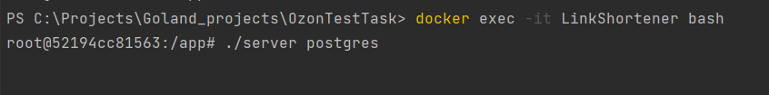
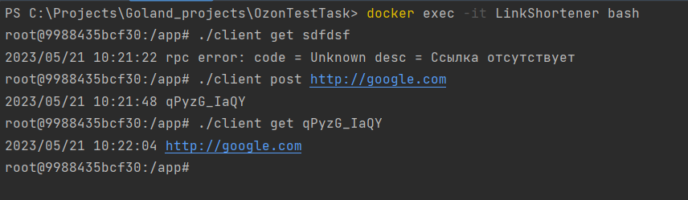

## LinkShortener

Для сборки и запуска введите `docker-compose up -d`

Войдите в контейнер с приложением, используя команду `docker exec -it LinkShortener bash`, а затем
запустите сервер с желаемым хранилищем (postgres, in_memory) `./server postgres`

Сервис запущен.

Для отправки запросов, в контейнере создан исполняемый файл `client`.
Откройте новый терминал, войдите в контейнер через `docker exec -it LinkShortener bash`, и запустите клиента с 2мя аргументами:
используемый метод (post - дать URL-адрес и получить короткую ссылку, get - дать короткую ссылку и получить URL-адрес) и ссылка, оригинальная или короткая.

Пример: `./client post http://google.com`

